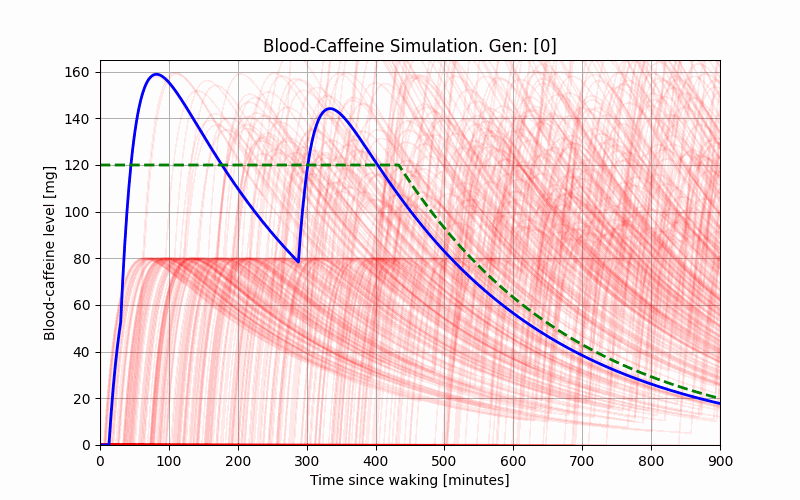

# Blood-Caffeine Simulations

These scripts simulate the breakdown of caffeine pills in your stomach, absorption of caffeine into your bloodstream, and its dissipation over time. There are two driver scripts for the class that allow the user to either input a pill schedule and see the resulting caffeine profiles or to define optimal daytime/nighttime caffeine levels and how many pills they want to take and then use machine learning (genetic algorithm) to find the optimal time to take their pills.

3x100mg Pills Machine-Learning Optimization:

### Usage Example

* Open the driver_user.py script define your pill schedule and paramaters and then run the script. The script will analyze the data and create a figure for your stomach-caffeine levels and another for your blood-caffeine levels.

-OR-

* Alternatively, open and modify the settings_ml.py file, define your paramaters, and run the script. In time the script will optimize your pill schedule to figure out when you should be taking them.

6x50mg Pills Machine-Learning Optimization:

### Author
* Teddy Rowan
